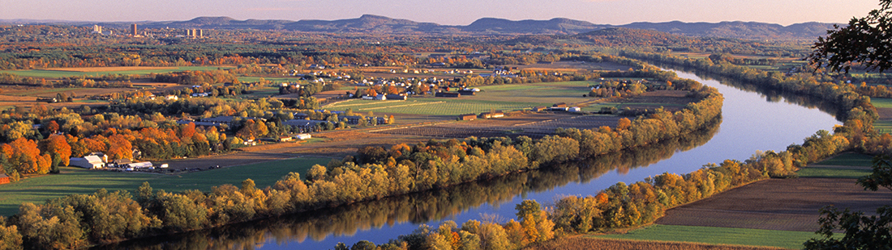

#### General Information

The inaugural **New England Theory Day** event aims to bring together theoreticians from around New England, for a full day of talks, a poster session for junior researchers, and social events. Anyone with an interest in theoretical computer science is welcome to attend.

The event is hosted by the [UMass Amherst Theory Group](https://theory.cs.umass.edu/), and funded by the [Manning College of Information and Computer Sciences](https://www.cics.umass.edu/).

* **Date**: Friday, October 17th, 2025
* **Location**: University of Massachusetts Amherst, Manning College of Information and Computer Science. 
  * Lederle Graduate Research Center (LGRC Lowrise), 740 North Pleasant Street, Amherst, MA.

Any questions about the event can be directed to Cameron Musco (cmusco at cs dot umass dot edu).

#### Registration

Registration is required, but free. Please register [here](https://docs.google.com/forms/d/e/1FAIpQLSekWt8YZW7afDNdB5Dn0FbdxfNA02x7DFdNOIbWMjH_FZ-nAw/viewform).

#### Travel, Parking, and Lodging

Parking passes will be provided to all registered participants that intend to drive to the event. Please indicate on the registration form if you will need a pass for your car.

Other transportation options include Peter Pan or Greyhound buslines (both with  stops on campus), or Amtrak (station in Northampton, approximately a 15 minute drive from campus). See [this page](https://www.umass.edu/transportation/regional-transportation) for more details.

If you plan to stay overnight before or after the event, some recommended lodging options are [Hotel UMass](http://www.hotelumass.com/) (on campus), [Inn on Boltwood](https://www.innonboltwood.com/) (downtown Amherst, accessible via bus or walking  to campus), or [Courtyard by Marriot Hadley](http://www.marriott.com/hotels/travel/bdlhd-courtyard-amherst-hadley/) (approximately 10 minutes driving from campus).

#### Schedule (Tentative)

<table>
  <thead>
    <tr>
      <th>Time</th>
      <th>Event</th>
      <th>Location</th>
    </tr>
  </thead>
  <tbody>
    <tr>
      <td>9:00am -- 10:00am</td>
      <td>Coffee, Breakfast, and Welcome</td>
      <td>LGRC A112</td>
    </tr>
    <tr>
      <td>10:00am -- 11:00am</td>
      <td>Invited Talk 1</td>
      <td>LGRC A112</td>
    </tr>
    <tr>
      <td>11:00am -- 12:00pm</td>
      <td>Invited Talk 2</td>
      <td>LGRC A112</td>
    </tr>
    <tr>
      <td>12:00pm -- 12:30pm</td>
      <td>Student Lightening Talks</td>
      <td>LGRC A112</td>
    </tr>
    <tr>
      <td>12:30pm -- 2:30pm</td>
      <td>Lunch and Poster Session</td>
      <td>LGRC A112 and LGRC Attrium</td>
    </tr>
    <tr>
      <td>2:30pm -- 3:30pm</td>
      <td>Invited Talk 3</td>
      <td>LGRC A112</td>
    </tr>
    <tr>
      <td>3:30pm -- 4:30pm</td>
      <td>Invited Talk 4</td>
      <td>LGRC A112</td>
    </tr>
    <tr>
      <td>4:30pm -- 5:00pm</td>
      <td>Wrap-up + Coffee, tea, and snacks</td>
      <td>LGRC A112</td>
    </tr>
    <tr>
      <td>6:00pm -- 7:30pm</td>
      <td>Informal Meetup at Treehouse Brewery</td>
      <td>Treehouse Brewing, South Deerfield, MA</td>
    </tr>
  </tbody>
</table>

 
