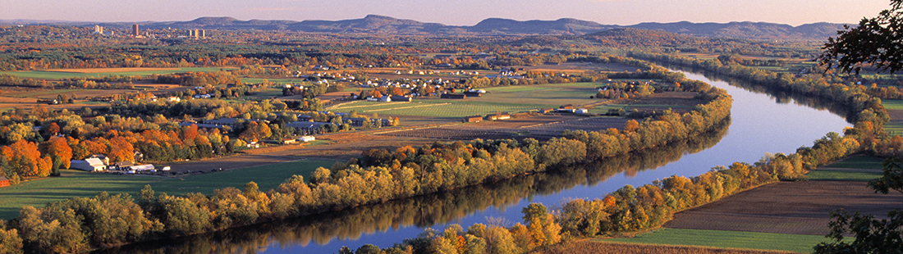

#### General Information

The **New England Theory Day** event aims to bring together theoreticians from around New England, for a full day of talks, a poster session for junior researchers, and social events. Anyone with an interest in theoretical computer science is welcome to attend.

The event is hosted by the [UMass Amherst Theory Group](https://theory.cs.umass.edu/){: class="manualBody"}, and funded by the [Manning College of Information and Computer Sciences](https://www.cics.umass.edu/){: class="manualBody"}.

* **Date**: Friday, October 2nd, 2026
* **Location**: University of Massachusetts Amherst, Manning College of Information and Computer Sciences.
  * Computer Science Laboratories (CSL) Building, Room E144, 130 Governors Dr, Amherst, MA.

Any questions about the event can be directed to Hung Le (hungle at cs dot umass dot edu) and Mingda Qiao (mqiao at cs dot umass dot edu).

#### Registration

Registration is now closed. Thank you to everyone who registered! We look forward to seeing you at UMass Amherst on October 2!

#### Travel, Parking, and Lodging

Parking passes will be provided to all registered participants that intend to drive to the event. Please indicate on the registration form if you will need a pass for your car.

Other transportation options include Peter Pan or Greyhound buslines (both with stops on campus), or Amtrak (station in Northampton, approximately a 15 minute drive from campus). See [this page](https://www.umass.edu/transportation/alternative-transportation/regional-transportation){: class="manualBody"} for more details.

If you plan to stay overnight before or after the event, some recommended lodging options are [Hotel UMass](http://www.hotelumass.com/){: class="manualBody"} (on campus), [Inn on Boltwood](https://www.innonboltwood.com/){: class="manualBody"} (downtown Amherst, accessible via bus or walking to campus), or [Courtyard by Marriott Hadley Amherst](https://www.marriott.com/en-us/hotels/bdlhd-courtyard-hadley-amherst/overview/){: class="manualBody"} (approximately 10 minutes driving from campus).

#### Schedule (Tentative)

<table>
  <thead>
    <tr>
      <th>Time</th>
      <th>Event</th>
      <th>Location</th>
    </tr>
  </thead>
  <tbody>
    <tr>
      <td>9:00am–10:00am</td>
      <td>Coffee, Breakfast, and Welcome</td>
      <td>CSL E144</td>
    </tr>
    <tr>
      <td>10:00am–10:50am</td>
      <td>Ronitt Rubinfeld (MIT): <i>Graph k-Coloring in Average Sublinear Time</i></td>
      <td>CSL E144</td>
    </tr>
    <tr>
      <td>11:00am–11:50am</td>
      <td>Talk by Mahsa Derakhshan (Northeastern)</td>
      <td>CSL E144</td>
    </tr>
    <tr>
      <td>12:00pm–12:30pm</td>
      <td>Student Lightning Talks</td>
      <td>CSL E144</td>
    </tr>
    <tr>
      <td>12:30pm–2:30pm</td>
      <td>Lunch and Poster Session</td>
      <td>CSL E144 and CSL Atrium</td>
    </tr>
    <tr>
      <td>2:30pm–3:20pm</td>
      <td>Deeparnab Chakrabarty (Dartmouth): <i>Graph (and Hypergraph) Algorithms in the CUT Query Lens</i></td>
      <td>CSL E144</td>
    </tr>
    <tr>
      <td>3:30pm–4:20pm</td>
      <td>Peihan Miao (Brown): <i>Recent Advances in Private Set Intersection</i></td>
      <td>CSL E144</td>
    </tr>
    <tr>
      <td>4:30pm–5:00pm</td>
      <td>Wrap-up + Coffee, tea, and snacks</td>
      <td>CSL E144</td>
    </tr>
    <tr>
      <td>6:00pm–7:30pm</td>
      <td>Informal Meetup</td>
      <td>Tree House Brewing Company, South Deerfield, MA</td>
    </tr>
  </tbody>
</table>

#### Talk Details

##### Graph k-Coloring in Average Sublinear Time

[Ronitt Rubinfeld](https://people.csail.mit.edu/ronitt/) (Massachusetts Institute of Technology)

Abstract

Graph k-coloring is one of the classic NP-complete problems. Previous work has studied its average-case complexity, defined as the average runtime over all k-colorable graphs on n vertices, required to compute a k-coloring. A highly influential result of Dyer and Frieze from 1989 gave an algorithm with O(n^2) average runtime for constant k. This quadratic runtime appeared natural (and possibly even optimal) since almost all k-colorable graphs have Theta(n^2) edges. Reading the entire adjacency matrix takes Theta(n^2) time, so any improvement must avoid inspecting the whole input. This was later improved by Kucera in 1995 to average runtime O(n^2/k) for every k < n^c where c \in (0, 1/2). Nevertheless, in the most interesting case of k = O(1), the best-known bound remained quadratic in n. The true average complexity of the k-coloring problem has remained elusive for the last three decades.

We break the longstanding quadratic barrier. Our main result shows that the exact average-case complexity of this fundamental problem is Theta(nk) for every 2 < k < n^{c'} and c' \in (0, 1/36). For k = O(1), this reveals the average sublinear nature of k-colorability: the average-case complexity is linear in n, and thus *sublinear* in the size of the input. The matching lower bound applies to every algorithm that correctly k-colors every k-colorable input.

Our proofs draw on ideas from sublinear and local algorithms and also yield a local computation algorithm (LCA) for k-coloring with average-case probe complexity poly(k). A key ingredient is an efficiently checkable certificate of unique colorability for small random cores, based on degree and codegree conditions. This certificate allows the algorithm to propagate colors correctly without inspecting the entire graph.

Bio

Ronitt Rubinfeld is an Edwin Sibley Webster Professor at MIT’s Electrical Engineering and Computer Science department, where she has been on the faculty since 2004. She graduated from the University of Michigan with a degree in Computer Engineering, and from the University of California, Berkeley with a Ph.D. in Computer Science in 1990. After postdoctoral positions at Princeton University and the Hebrew University in Jerusalem, she held faculty positions at Cornell University and Tel Aviv University, and has been a member of the research staff at NEC Research Institute. Her work has received the Symposium on Theory of Computing 30 years Test of Time award. Ronitt Rubinfeld was an ONR Young Investigator, a Sloan Fellow, a Guggenheim fellow and an invited speaker at the International Congress of Mathematicians in 2006. She is a fellow of the Association for Computing Machinery, a fellow of the American Academy of Arts and Sciences and a member of the National Academy of Sciences.

##### Graph (and Hypergraph) Algorithms in the CUT Query Lens

[Deeparnab Chakrabarty](https://deeparnab.cs.dartmouth.edu/) (Dartmouth College)

Abstract

In the "query access model" of algorithm design, we have access to the input data only via restricted interfaces. This study is motivated, at times, due to restrictions in certain applications; perhaps more relevant to this audience, it provides a lens to focus on the powers and limitations of algorithmic ideas. In the past few years, there has been some focused interest on the question of understanding connectivity of graphs when we have access to it only via "CUT queries": in this access model we know the vertices of a graph, but not its edges; at unit cost we can query a subset of vertices and obtain the cut *size*. The cut induced by the subset, recall, is the edges with exactly one endpoint in the subset. 

In this talk, I will expand on the abstract above, and try to chart out the state of the art. I will explain the broad techniques, and also some technical challenges where we are stuck.

I will mostly be talking about other people's work; if I do talk about works where I have contributed, then they will be those with my recently graduated student Hang Liao whose thesis was on this topic.

Bio

Deeparnab Chakrabarty is an associate professor of computer science at Dartmouth College where he has taught since 2017. Before that, he was a researcher at Microsoft Research Bangalore. His research interests are broadly in algorithms, with a special interest in optimization and sublinear algorithms.

##### Recent Advances in Private Set Intersection

[Peihan Miao](https://sites.google.com/view/peihanmiao/home) (Brown University)

Abstract

Private set intersection (PSI) enables two parties, each holding a private set of elements, to compute the intersection of their sets without revealing anything beyond the intersection. As a special case of secure multi-party computation, PSI has found many applications and shown early success in practice. In this talk, I will first give an overview of the limitations of standard PSI protocols in terms of functionality, security, and scalability. Next, I will discuss recent advances in developing new models and techniques to address these challenges.

Bio

Peihan Miao is the John E. Savage Assistant Professor in the Department of Computer Science at Brown University. Her research interests lie in cryptography, theory, and security, with a focus on secure multi-party computation. She received her PhD from the University of California, Berkeley. She is a recipient of the NSF CAREER Award, Meta Privacy Enhancing Technologies Award, Google Research Scholar Award, and Amazon Research Award.

#### Previous Edition

[2025 New England Theory Day](/theory-day-2025)

 